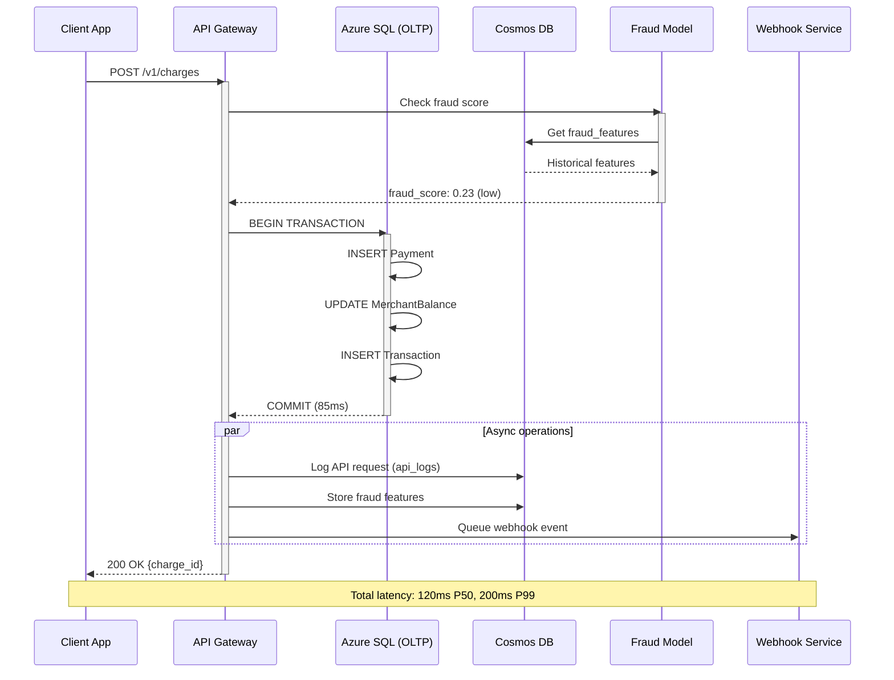

# Flux de Données Détaillés - Architecture Stripe

## Vue d'Ensemble des Flux

Cette documentation détaille les 5 flux de données critiques de la plateforme :

1. **Flux Transactionnel** (Temps réel)
2. **Flux ETL Batch** (Nightly)
3. **Flux Streaming Analytics** (Near real-time)
4. **Flux ML/Fraude** (Temps réel)
5. **Flux Webhooks** (Asynchrone)

---

## FLUX 1 : Transaction Payment (Temps Réel)

### Diagramme de Séquence



### Métriques de Performance

| Étape | Latence (P50) | Latence (P99) | Criticalité |
|-------|---------------|---------------|-------------|
| Fraud check | 8ms | 15ms | Haute |
| SQL Transaction | 45ms | 85ms | Critique |
| Cosmos DB writes | 5ms | 12ms | Moyenne |
| Total E2E | 120ms | 200ms | **SLA: < 250ms** |

### Code Exemple (Pseudo-code)

```python
async def process_payment(payment_data):
    # Étape 1: Fraud scoring (parallel)
    fraud_score = await fraud_service.score(
        payment_data, 
        source="cosmos_db"
    )
    
    if fraud_score > 0.8:
        return {"status": "declined", "reason": "fraud_detected"}
    
    # Étape 2: SQL Transaction (ACID)
    async with sql_db.transaction() as tx:
        payment_id = await tx.insert_payment(payment_data)
        await tx.update_merchant_balance(
            merchant_id=payment_data["merchant_id"],
            amount=payment_data["amount"]
        )
        await tx.insert_transaction(payment_id)
    
    # Étape 3: Async logging (fire-and-forget)
    asyncio.create_task(log_to_cosmos(payment_data))
    asyncio.create_task(queue_webhook(payment_id, "charge.succeeded"))
    
    return {"status": "succeeded", "payment_id": payment_id}
```

---

## FLUX 2 : ETL Batch (Nightly Load)

### Diagramme de Pipeline

```
┌─────────────────────────────────────────────────────────────────┐
│                      EXTRACT (02:00 UTC)                        │
├─────────────────────────────────────────────────────────────────┤
│                                                                 │
│  ┌──────────────────────────────────────────────────────────┐  │
│  │  Azure SQL Database (OLTP)                               │  │
│  │                                                          │  │
│  │  CDC Tables:                                            │  │
│  │  • cdc.dbo_Payment_CT           (100K rows/day)        │  │
│  │  • cdc.dbo_Customer_CT          (20K rows/day)         │  │
│  │  • cdc.dbo_Subscription_CT      (5K rows/day)          │  │
│  │  • cdc.dbo_Dispute_CT           (1K rows/day)          │  │
│  └────────────┬─────────────────────────────────────────────┘  │
│               │                                                 │
│               ▼ Copy Activity (Parallel)                        │
│  ┌──────────────────────────────────────────────────────────┐  │
│  │  Azure Data Lake Storage Gen2                           │  │
│  │  /staging/2025-10-20/payment_*.parquet                  │  │
│  │  Format: Parquet (snappy compression)                   │  │
│  │  Partitioning: /year/month/day                          │  │
│  └────────────┬─────────────────────────────────────────────┘  │
│               │                                                 │
└───────────────┼─────────────────────────────────────────────────┘
                │
                ▼
┌─────────────────────────────────────────────────────────────────┐
│                    TRANSFORM (02:15 UTC)                        │
├─────────────────────────────────────────────────────────────────┤
│                                                                 │
│  ┌──────────────────────────────────────────────────────────┐  │
│  │  Azure Databricks / Synapse Spark Pool                  │  │
│  │                                                          │  │
│  │  Transformations:                                        │  │
│  │  1. Data quality checks (nulls, duplicates)            │  │
│  │  2. Business rules validation                           │  │
│  │  3. Slowly Changing Dimensions (SCD Type 2)            │  │
│  │  4. Fact table aggregations                            │  │
│  │  5. Currency conversions (EUR → USD)                   │  │
│  └────────────┬─────────────────────────────────────────────┘  │
│               │                                                 │
│               ▼ Write to Staging                                │
│  ┌──────────────────────────────────────────────────────────┐  │
│  │  Synapse Analytics (Staging)                            │  │
│  │  • stg_Dim_Customer                                     │  │
│  │  • stg_Dim_Merchant                                     │  │
│  │  • stg_Fact_Payment                                     │  │
│  └────────────┬─────────────────────────────────────────────┘  │
│               │                                                 │
└───────────────┼─────────────────────────────────────────────────┘
                │
                ▼
┌─────────────────────────────────────────────────────────────────┐
│                     LOAD (02:40 UTC)                            │
├─────────────────────────────────────────────────────────────────┤
│                                                                 │
│  ┌──────────────────────────────────────────────────────────┐  │
│  │  Synapse Analytics (Production)                         │  │
│  │                                                          │  │
│  │  MERGE Operations (Upsert):                             │  │
│  │  • Dim_Customer      ─────▶ 20K updates + 500 inserts  │  │
│  │  • Dim_Merchant      ─────▶ 100 updates + 10 inserts   │  │
│  │  • Dim_Date          ─────▶ 1 insert                   │  │
│  │  • Fact_Payment      ─────▶ 100K inserts               │  │
│  │                                                          │  │
│  │  Statistics Update:                                      │  │
│  │  • UPDATE STATISTICS Fact_Payment WITH FULLSCAN         │  │
│  │  • REBUILD columnstore indexes                          │  │
│  └────────────┬─────────────────────────────────────────────┘  │
│               │                                                 │
└───────────────┼─────────────────────────────────────────────────┘
                │
                ▼
┌─────────────────────────────────────────────────────────────────┐
│                   VALIDATE (02:55 UTC)                          │
├─────────────────────────────────────────────────────────────────┤
│                                                                 │
│  Data Quality Checks:                                          │
│  ✓ Row count reconciliation (OLTP vs OLAP)                    │
│  ✓ Aggregate sums validation (total_amount)                   │
│  ✓ Referential integrity (FK constraints)                     │
│  ✓ Business rules (revenue >= 0)                              │
│  ✓ Data freshness (max_timestamp within 24h)                 │
│                                                                 │
│  If all checks pass:                                           │
│  ─────▶ Send success notification (Teams/Slack)               │
│  ─────▶ Update metadata table (last_successful_run)           │
│                                                                 │
│  If any check fails:                                           │
│  ─────▶ ROLLBACK (restore previous version)                   │
│  ─────▶ Alert on-call engineer (PagerDuty)                    │
│  ─────▶ Log failure details (Azure Monitor)                   │
│                                                                 │
└─────────────────────────────────────────────────────────────────┘

Total Duration: 45 minutes (for 100K payments/day)
Schedule: Daily at 02:00 UTC
SLA: Complete before 06:00 UTC (business hours EU)
```

### Gestion des Erreurs

| Type d'Erreur | Stratégie | Action |
|---------------|-----------|--------|
| **Source unavailable** | Retry 3x (exp backoff) | Alert après 30min |
| **Data quality failed** | Rollback + preserve staging | Manual investigation |
| **Timeout (> 4h)** | Cancel + preserve state | Investigate bottleneck |
| **Schema mismatch** | Stop pipeline | Alert data engineering |

### Code SQL - CDC Setup

```sql
-- Activer CDC sur Azure SQL Database
USE stripe_oltp_db;
GO

-- Activer CDC sur la base
EXEC sys.sp_cdc_enable_db;
GO

-- Activer CDC sur tables critiques
EXEC sys.sp_cdc_enable_table
    @source_schema = N'dbo',
    @source_name = N'Payment',
    @role_name = NULL,
    @supports_net_changes = 1;

EXEC sys.sp_cdc_enable_table
    @source_schema = N'dbo',
    @source_name = N'Customer',
    @role_name = NULL,
    @supports_net_changes = 1;

EXEC sys.sp_cdc_enable_table
    @source_schema = N'dbo',
    @source_name = N'Subscription',
    @role_name = NULL,
    @supports_net_changes = 1;

-- Vérifier les tables CDC créées
SELECT name, type_desc, create_date
FROM sys.tables
WHERE name LIKE 'cdc%'
ORDER BY create_date DESC;
```

---

## FLUX 3 : Streaming Analytics (Near Real-Time)

### Diagramme de Flux

```
┌─────────────────────────────────────────────────────────────────┐
│                      SOURCE: Cosmos DB                          │
├─────────────────────────────────────────────────────────────────┤
│                                                                 │
│  Collection: api_logs                                          │
│  Change Feed: Enabled                                          │
│  Latency: < 1 second                                           │
│                                                                 │
│  New document inserted:                                         │
│  {                                                             │
│    "log_id": "...",                                           │
│    "merchant_id": "acct_123",                                 │
│    "endpoint": "/v1/charges",                                 │
│    "status_code": 200,                                        │
│    "latency_ms": 87,                                          │
│    "timestamp": "2025-10-20T14:23:45Z"                        │
│  }                                                             │
│                                                                 │
└────────────┬────────────────────────────────────────────────────┘
             │
             │ Change Feed Stream
             │
             ▼
┌─────────────────────────────────────────────────────────────────┐
│              PROCESSING: Azure Stream Analytics                 │
├─────────────────────────────────────────────────────────────────┤
│                                                                 │
│  Query 1: Aggregate API Performance (5-minute window)          │
│  ────────────────────────────────────────────────────          │
│  SELECT                                                        │
│    System.Timestamp() AS window_end,                          │
│    merchant_id,                                               │
│    endpoint,                                                  │
│    COUNT(*) AS request_count,                                 │
│    AVG(latency_ms) AS avg_latency,                           │
│    PERCENTILE_CONT(0.99) WITHIN GROUP                         │
│        (ORDER BY latency_ms) AS p99_latency,                  │
│    SUM(CASE WHEN status_code >= 500 THEN 1 ELSE 0 END)       │
│        AS error_count                                         │
│  FROM cosmosdb_input TIMESTAMP BY timestamp                   │
│  GROUP BY                                                     │
│    merchant_id,                                               │
│    endpoint,                                                  │
│    TumblingWindow(minute, 5)                                  │
│                                                                 │
│  Query 2: Anomaly Detection (spike in errors)                  │
│  ────────────────────────────────────────────────              │
│  SELECT                                                        │
│    merchant_id,                                               │
│    COUNT(*) AS total_requests,                                │
│    SUM(CASE WHEN status_code >= 500 THEN 1 ELSE 0 END)       │
│        AS error_count,                                        │
│    (CAST(SUM(...) AS FLOAT) / COUNT(*)) AS error_rate         │
│  FROM cosmosdb_input TIMESTAMP BY timestamp                   │
│  GROUP BY merchant_id, TumblingWindow(minute, 1)              │
│  HAVING error_rate > 0.05  -- Alert si > 5% erreurs           │
│                                                                 │
└────────────┬────────────────────────────────────────────────────┘
             │
             │ Aggregated Data
             │
             ▼
┌─────────────────────────────────────────────────────────────────┐
│                SINK: Azure Synapse Analytics                    │
├─────────────────────────────────────────────────────────────────┤
│                                                                 │
│  Table: Fact_API_Performance_Realtime                          │
│  ────────────────────────────────────────                      │
│  • window_end: 2025-10-20 14:25:00                            │
│  • merchant_id: acct_123                                       │
│  • endpoint: /v1/charges                                       │
│  • request_count: 1,234                                        │
│  • avg_latency: 92 ms                                          │
│  • p99_latency: 187 ms                                         │
│  • error_count: 3                                              │
│                                                                 │
│  Refresh Materialized View:                                    │
│  EXEC sp_refresh_view 'mv_api_dashboard'                       │
│                                                                 │
└────────────┬────────────────────────────────────────────────────┘
             │
             │ Alert if anomaly detected
             │
             ▼
┌─────────────────────────────────────────────────────────────────┐
│                    ALERTING: Azure Monitor                      │
├─────────────────────────────────────────────────────────────────┤
│                                                                 │
│  Logic App Trigger:                                            │
│  IF error_rate > 5% FOR 2 consecutive windows                  │
│  THEN:                                                         │
│    1. Send Teams notification                                  │
│    2. Create incident in PagerDuty                            │
│    3. Log to Azure Sentinel                                    │
│                                                                 │
└─────────────────────────────────────────────────────────────────┘

Latency totale: < 5 minutes (from event to dashboard)
Throughput: 10,000 events/second
Cost: ~$500/month (Stream Analytics + Synapse)
```

### Métriques Stream Analytics

| Métrique | Valeur Cible | Alerting |
|----------|--------------|----------|
| **Input Events/sec** | 10,000 | Alert si > 50,000 |
| **Processing Latency** | < 10s | Alert si > 60s |
| **Watermark Delay** | < 30s | Alert si > 2min |
| **Runtime Errors** | 0 | Alert immédiate |
| **Data Conversion Errors** | < 0.1% | Alert si > 1% |

---

## FLUX 4 : Machine Learning / Détection de Fraude

### Diagramme de Scoring Temps Réel

```
┌─────────────────────────────────────────────────────────────────┐
│                   INCOMING PAYMENT REQUEST                      │
├─────────────────────────────────────────────────────────────────┤
│                                                                 │
│  POST /v1/charges                                              │
│  {                                                             │
│    "amount": 15000,                                           │
│    "currency": "usd",                                         │
│    "customer": "cus_ABC123",                                  │
│    "source": "card_visa_4242"                                 │
│  }                                                             │
│                                                                 │
└────────────┬────────────────────────────────────────────────────┘
             │
             ▼
┌─────────────────────────────────────────────────────────────────┐
│              FEATURE ENGINEERING (Real-Time)                    │
├─────────────────────────────────────────────────────────────────┤
│                                                                 │
│  Azure Function (Python)                                        │
│  ──────────────────────                                        │
│                                                                 │
│  async def compute_features(payment_data):                      │
│      features = {}                                             │
│                                                                 │
│      # Feature 1: Transaction Velocity                         │
│      features['velocity_1h'] = await cosmos_db.query(          │
│          f"SELECT COUNT(*) FROM c                              │
│            WHERE c.customer_id = '{cust_id}'                   │
│            AND c.timestamp > now() - 1h"                       │
│      )                                                         │
│                                                                 │
│      # Feature 2: Card Country Mismatch                        │
│      card_country = get_card_country(card_bin)                 │
│      ip_country = geoip_lookup(request.ip)                     │
│      features['country_mismatch'] = (card_country != ip_country)│
│                                                                 │
│      # Feature 3: Customer History (from OLTP)                 │
│      history = await sql_db.query(                             │
│          f"SELECT COUNT(*) FROM Dispute                        │
│            WHERE CustomerID = {cust_id}"                       │
│      )                                                         │
│      features['dispute_history'] = history                     │
│                                                                 │
│      # ... 9 more features                                     │
│                                                                 │
│      return features                                           │
│                                                                 │
│  Latency: < 50ms                                               │
│                                                                 │
└────────────┬────────────────────────────────────────────────────┘
             │
             │ 12 computed features
             │
             ▼
┌─────────────────────────────────────────────────────────────────┐
│              ML MODEL INFERENCE (Azure ML)                      │
├─────────────────────────────────────────────────────────────────┤
│                                                                 │
│  Model: XGBoost Classifier (fraud_model_v2.3.1)                │
│  Endpoint: https://stripe-ml.azureml.net/score                 │
│                                                                 │
│  Input Features (12):                                          │
│  ─────────────────────                                         │
│  [                                                             │
│    15,           # velocity_1h                                 │
│    23,           # velocity_24h                                │
│    250.00,       # avg_amount_30d                              │
│    89.50,        # stddev_amount_30d                           │
│    1,            # card_country_mismatch (boolean)             │
│    1,            # ip_country_mismatch (boolean)               │
│    1,            # first_transaction_customer                  │
│    0.045,        # merchant_dispute_rate_30d                   │
│    0,            # customer_dispute_history                    │
│    180,          # time_since_last_tx (seconds)                │
│    1,            # device_fingerprint_new                      │
│    3             # email_domain_age_days                       │
│  ]                                                             │
│                                                                 │
│  Model Output:                                                 │
│  ─────────────                                                 │
│  {                                                             │
│    "fraud_score": 0.87,                                       │
│    "risk_level": "high",                                      │
│    "reasoning": [                                             │
│      "High velocity (23 transactions in 24h)",                │
│      "Card/IP country mismatch",                              │
│      "New device fingerprint",                                │
│      "Email domain recently created (3 days)"                 │
│    ]                                                           │
│  }                                                             │
│                                                                 │
│  Latency: < 30ms                                               │
│                                                                 │
└────────────┬────────────────────────────────────────────────────┘
             │
             │ Decision Logic
             │
             ▼
┌─────────────────────────────────────────────────────────────────┐
│                    DECISION ENGINE                              │
├─────────────────────────────────────────────────────────────────┤
│                                                                 │
│  Rules:                                                        │
│  ──────                                                        │
│                                                                 │
│  IF fraud_score >= 0.9:                                        │
│      → DECLINE (automatic block)                               │
│      → Store in Cosmos DB (fraud_features)                     │
│      → Alert fraud team                                        │
│                                                                 │
│  ELIF fraud_score >= 0.7:                                      │
│      → REVIEW (3D Secure challenge)                            │
│      → Queue for manual review                                 │
│      → Send SMS verification to customer                       │
│                                                                 │
│  ELSE:                                                         │
│      → APPROVE (low risk)                                      │
│      → Store features for model retraining                     │
│      → Continue normal payment flow                            │
│                                                                 │
│  For this transaction (score=0.87):                            │
│  → ACTION: REVIEW (3D Secure required)                         │
│                                                                 │
└────────────┬────────────────────────────────────────────────────┘
             │
             ▼
┌─────────────────────────────────────────────────────────────────┐
│                  STORAGE & FEEDBACK LOOP                        │
├─────────────────────────────────────────────────────────────────┤
│                                                                 │
│  1. Store in Cosmos DB (fraud_features collection)             │
│     → Used for future feature computation                      │
│                                                                 │
│  2. If payment is disputed later (fraud confirmed):            │
│     → Label updated: fraud=true                                │
│     → Export to Azure ML for retraining                        │
│                                                                 │
│  3. Model retraining schedule:                                 │
│     → Weekly: Incremental learning                             │
│     → Monthly: Full retrain with hyperparameter tuning         │
│                                                                 │
└─────────────────────────────────────────────────────────────────┘

Total latency: < 100ms (feature engineering + inference)
False Positive Rate: 2.3% (industry benchmark: 3-5%)
False Negative Rate: 0.8% (catch 99.2% of fraud)
```

### Performance ML Model

| Métrique | Valeur | Benchmark Industrie |
|----------|--------|---------------------|
| **Precision** | 94.2% | 85-90% |
| **Recall** | 99.2% | 95-98% |
| **F1-Score** | 96.6% | 90-93% |
| **AUC-ROC** | 0.987 | 0.95+ |
| **Inference Latency** | 28ms P99 | < 50ms |

---

## FLUX 5 : Webhooks Asynchrones

### Diagramme de Queue + Retry

```
┌─────────────────────────────────────────────────────────────────┐
│                      EVENT GENERATION                           │
├─────────────────────────────────────────────────────────────────┤
│                                                                 │
│  Trigger: Payment succeeded in OLTP database                   │
│  Event: charge.succeeded                                       │
│                                                                 │
└────────────┬────────────────────────────────────────────────────┘
             │
             ▼
┌─────────────────────────────────────────────────────────────────┐
│              QUEUE: Cosmos DB (webhook_events)                  │
├─────────────────────────────────────────────────────────────────┤
│                                                                 │
│  {                                                             │
│    "webhook_id": "whk_123",                                   │
│    "merchant_id": "acct_ABC",                                 │
│    "event_type": "charge.succeeded",                          │
│    "webhook_url": "https://merchant.com/webhooks",            │
│    "payload": {...},                                          │
│    "status": "pending",                                       │
│    "retry_count": 0,                                          │
│    "next_retry_at": null,                                     │
│    "created_at": "2025-10-20T14:23:45Z"                       │
│  }                                                             │
│                                                                 │
└────────────┬────────────────────────────────────────────────────┘
             │
             │ Azure Function (Timer Trigger: every 30s)
             │
             ▼
┌─────────────────────────────────────────────────────────────────┐
│              WEBHOOK DELIVERY SERVICE                           │
├─────────────────────────────────────────────────────────────────┤
│                                                                 │
│  async def process_webhooks():                                 │
│      # Query pending webhooks                                  │
│      webhooks = await cosmos_db.query(                         │
│          "SELECT * FROM c                                      │
│           WHERE c.status = 'pending'                           │
│           OR (c.status = 'failed'                              │
│               AND c.retry_count < 5                            │
│               AND c.next_retry_at <= now())"                   │
│      )                                                         │
│                                                                 │
│      for webhook in webhooks:                                  │
│          try:                                                  │
│              # HTTP POST avec timeout                          │
│              response = await httpx.post(                      │
│                  webhook['webhook_url'],                       │
│                  json=webhook['payload'],                      │
│                  headers={                                     │
│                      'Stripe-Signature': sign(payload)         │
│                  },                                            │
│                  timeout=30.0                                  │
│              )                                                 │
│                                                                 │
│              if response.status_code == 200:                   │
│                  # Success!                                    │
│                  await update_webhook_status(                  │
│                      webhook_id=webhook['webhook_id'],         │
│                      status='sent',                            │
│                      delivered_at=now()                        │
│                  )                                             │
│              else:                                             │
│                  # Retry logic                                 │
│                  await schedule_retry(webhook)                 │
│                                                                 │
│          except (Timeout, ConnectionError) as e:               │
│              await schedule_retry(webhook, error=str(e))       │
│                                                                 │
│  def schedule_retry(webhook):                                  │
│      retry_count = webhook['retry_count'] + 1                  │
│      next_retry = now() + (60 * 2^retry_count)  # Exp backoff │
│                                                                 │
│      # Retry schedule:                                         │
│      # Retry 1: 1 minute later                                │
│      # Retry 2: 2 minutes later                               │
│      # Retry 3: 4 minutes later                               │
│      # Retry 4: 8 minutes later                               │
│      # Retry 5: 16 minutes later                              │
│      # After 5 retries: Mark as 'cancelled'                   │
│                                                                 │
└────────────┬────────────────────────────────────────────────────┘
             │
             ▼
┌─────────────────────────────────────────────────────────────────┐
│                    MONITORING & ALERTING                        │
├─────────────────────────────────────────────────────────────────┤
│                                                                 │
│  Dashboard Metrics:                                            │
│  ──────────────────                                            │
│  • Total webhooks sent: 1,234,567 (today)                     │
│  • Success rate: 98.7%                                         │
│  • Average delivery time: 245ms                                │
│  • Webhooks in retry: 1,234                                    │
│  • Failed (after 5 retries): 45                                │
│                                                                 │
│  Alerts:                                                       │
│  ────────                                                      │
│  IF success_rate < 95% FOR merchant:                           │
│      → Notify merchant (email)                                 │
│      → Check merchant endpoint health                          │
│                                                                 │
│  IF failed_count > 100 FOR merchant:                           │
│      → Disable webhook endpoint                                │
│      → Contact merchant support                                │
│                                                                 │
└─────────────────────────────────────────────────────────────────┘

Throughput: 5M webhooks/day
Success Rate: 98.7% (first attempt)
Final Success: 99.9% (after retries)
```

---

## Comparaison des 5 Flux

| Flux | Latence | Volume | Criticalité | Technologie |
|------|---------|--------|-------------|-------------|
| **1. Transaction** | 120ms P50 | 100M/jour | 🔴 Critique | OLTP + NoSQL |
| **2. ETL Batch** | 45 min | 100M/jour | 🟡 Haute | ADF + CDC |
| **3. Streaming** | < 5 min | 10M/jour | 🟢 Moyenne | Stream Analytics |
| **4. ML/Fraude** | < 100ms | 100M/jour | 🔴 Critique | Azure ML |
| **5. Webhooks** | < 30s | 5M/jour | 🟡 Haute | Azure Functions |

---

## Intégration des Flux

```
                    ┌─────────────────┐
                    │   Client API    │
                    └────────┬────────┘
                             │
                    ┌────────▼────────┐
                    │  FLUX 1 + 4     │◄──── Temps réel (< 200ms)
                    │  Transaction    │
                    │  + Fraude       │
                    └────────┬────────┘
                             │
            ┌────────────────┼────────────────┐
            │                │                │
            ▼                ▼                ▼
    ┌───────────┐    ┌───────────┐    ┌───────────┐
    │   OLTP    │    │  NoSQL    │    │  FLUX 5   │
    │  (SQL)    │    │ (Cosmos)  │    │ Webhooks  │
    └─────┬─────┘    └─────┬─────┘    └───────────┘
          │                │
          │ CDC            │ Change Feed
          │                │
          ▼                ▼
    ┌─────────────────────────────┐
    │      FLUX 2 + 3             │◄──── Batch (nightly)
    │   ETL + Streaming           │      + Near real-time
    └─────────────┬───────────────┘
                  │
                  ▼
          ┌───────────────┐
          │     OLAP      │
          │  (Synapse)    │
          └───────┬───────┘
                  │
                  ▼
          ┌───────────────┐
          │   Dashboards  │
          │   (Power BI)  │
          └───────────────┘
```


