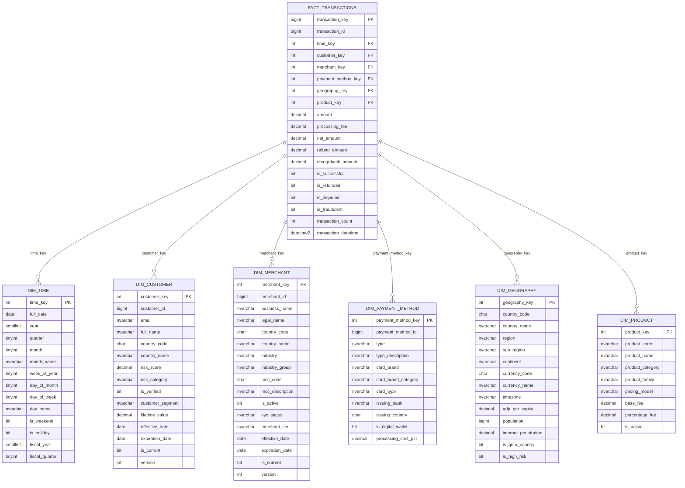

# Star Schema - Stripe OLAP

## Diagramme du Schéma en Étoile


## Architecture Technique

### Distribution Strategy
```
┌─────────────────────────────────────┐
│    FACT_TRANSACTIONS                │
│    Distribution: HASH(customer_key) │
│    60 Compute Nodes                 │
└───────────┬─────────────────────────┘
            │
            │ Data distributed across nodes
            │
    ┌───────▼─────┬─────────┬─────────┐
    │   Node 1    │ Node 2  │  ...60  │
    │   ~1/60     │  ~1/60  │  ~1/60  │
    └─────────────┴─────────┴─────────┘

┌─────────────────────────────────────┐
│    ALL DIMENSIONS                   │
│    Distribution: REPLICATE          │
│    Full copy on each node           │
└───────────┬─────────────────────────┘
            │
            │ Replicated to all nodes
            │
    ┌───────▼─────┬─────────┬─────────┐
    │   Node 1    │ Node 2  │  ...60  │
    │   FULL      │  FULL   │  FULL   │
    └─────────────┴─────────┴─────────┘
```

**Avantage** : Zéro data movement sur les joins !

### Partitionnement Temporel
```
FACT_TRANSACTIONS partitionné par time_key (mensuel)

│2025-01│2025-02│2025-03│ ... │2025-12│2026-01│ ...
├───────┼───────┼───────┼─────┼───────┼───────┼─────
│ Part1 │ Part2 │ Part3 │ ... │Part12 │Part13 │ ...
└───────┴───────┴───────┴─────┴───────┴───────┴─────

Requête avec WHERE time_key BETWEEN 20250301 AND 20250331
→ Scan uniquement Partition 3 (Mars 2025)
→ Partition elimination = 11/12 données ignorées !
```

## Cardinalités Estimées

| Dimension | Lignes | Taille |
|-----------|--------|--------|
| dim_time | 9,000 | ~1 MB |
| dim_customer | 15M | ~5 GB |
| dim_merchant | 150K | ~100 MB |
| dim_payment_method | 20M | ~3 GB |
| dim_geography | 250 | ~0.1 MB |
| dim_product | 100 | ~0.01 MB |
| **fact_transactions** | **300M** | **90 GB** |
| agg_daily_revenue | 150M | ~30 GB |
| agg_monthly_metrics | 3M | ~1 GB |

## Flux de Données ETL
```
┌──────────────┐
│  OLTP        │
│  Azure SQL   │
└──────┬───────┘
       │ CDC (Change Data Capture)
       │ Every 5 minutes
       ▼
┌──────────────┐
│  STAGING     │
│  Azure Blob  │
└──────┬───────┘
       │ Azure Data Factory
       │ Transformations:
       │ - Lookup surrogate keys
       │ - Calculate metrics
       │ - Data quality checks
       ▼
┌──────────────┐
│  OLAP        │
│  Synapse     │
└──────────────┘
```

## Requêtes Optimisées

### Exemple 1 : Revenue par mois (utilise partition elimination)
```sql
SELECT 
    t.year,
    t.month_name,
    SUM(f.amount) AS revenue
FROM fact_transactions f
INNER JOIN dim_time t ON f.time_key = t.time_key
WHERE t.year = 2025
GROUP BY t.year, t.month, t.month_name
ORDER BY t.month;
```

**Performance** :
- Partition elimination : scan seulement partitions 2025
- Columnstore compression : lecture ultra-rapide
- Temps d'exécution : < 2 secondes sur 300M lignes

### Exemple 2 : Top merchants (utilise aggregates)
```sql
SELECT TOP 10
    m.business_name,
    SUM(adr.total_amount) AS revenue
FROM agg_daily_revenue adr
INNER JOIN dim_merchant m ON adr.merchant_key = m.merchant_key
WHERE adr.date_key >= 20250101
    AND adr.date_key < 20260101
    AND m.is_current = 1
GROUP BY m.business_name
ORDER BY revenue DESC;
```

**Performance** :
- Utilise table pré-agrégée (150M vs 300M lignes)
- Temps d'exécution : < 1 seconde

## Maintenance

### Refresh Aggregates
```bash
# Daily (automated via Airflow)
EXEC sp_refresh_daily_aggregates @date_key = 20251016;

# Monthly (end of month)
EXEC sp_calculate_monthly_metrics @year_month = 202510;
```

### Partition Management
```sql
-- Archive old partitions (> 2 ans)
ALTER TABLE fact_transactions 
SWITCH PARTITION 1 TO fact_transactions_archive PARTITION 1;

-- Créer nouvelles partitions (future)
ALTER TABLE fact_transactions
SPLIT RANGE (20280101);

-- Rebuild pour optimiser compression
ALTER INDEX ALL ON fact_transactions REBUILD;
```

## SCD Type 2 en Action

### Exemple : Client change de segment
```
Avant :
customer_key | customer_id | segment  | effective_date | expiration_date | is_current
-------------|-------------|----------|----------------|-----------------|------------
1001         | 123         | Regular  | 2024-01-01     | NULL            | 1

Transaction aujourd'hui :
→ Client atteint seuil VIP

Après :
customer_key | customer_id | segment  | effective_date | expiration_date | is_current
-------------|-------------|----------|----------------|-----------------|------------
1001         | 123         | Regular  | 2024-01-01     | 2025-10-16      | 0
1002         | 123         | VIP      | 2025-10-16     | NULL            | 1

Nouvelles transactions pointent vers customer_key=1002
Anciennes transactions gardent customer_key=1001
→ Historique préservé !
```

## Comparaison : Queries OLTP vs OLAP

| Aspect | OLTP | OLAP |
|--------|------|------|
| **Type** | SELECT par ID | Agrégations |
| **Volume** | 1-1000 lignes | Millions de lignes |
| **Latence** | < 50ms | < 5 secondes |
| **Pattern** | Lecture/Écriture | Lecture seule |
| **Index** | B-Tree | Columnstore |
| **Normalisé** | Oui (3NF) | Non (Star) |
| **Exemple** | `WHERE transaction_id = 123` | `SUM(amount) GROUP BY year` |
```
