# ERD - Modèle OLTP Stripe

## Diagramme Entity-Relationship

```mermaid
erDiagram
    CUSTOMERS ||--o{ PAYMENT_METHODS : "owns"
    CUSTOMERS ||--o{ TRANSACTIONS : "makes"
    CUSTOMERS ||--o{ SUBSCRIPTIONS : "subscribes"
    
    MERCHANTS ||--o{ TRANSACTIONS : "receives"
    MERCHANTS ||--o{ SUBSCRIPTIONS : "offers"
    
    PAYMENT_METHODS ||--o{ TRANSACTIONS : "used_in"
    PAYMENT_METHODS ||--o{ SUBSCRIPTIONS : "charges"
    
    TRANSACTIONS ||--o{ REFUNDS : "has"
    TRANSACTIONS ||--o{ CHARGEBACKS : "disputed"
    TRANSACTIONS ||--|| FRAUD_CHECKS : "analyzed"
    
    SUBSCRIPTIONS ||--o{ SUBSCRIPTION_PAYMENTS : "generates"
    SUBSCRIPTION_PAYMENTS }o--|| TRANSACTIONS : "creates"
    
    CUSTOMERS {
        bigint customer_id PK
        nvarchar email UK
        nvarchar first_name
        nvarchar last_name
        nvarchar phone
        char country_code
        bit is_verified
        decimal risk_score
        datetime2 created_at
        datetime2 updated_at
        bit is_deleted
    }
    
    MERCHANTS {
        bigint merchant_id PK
        nvarchar business_name
        nvarchar legal_name
        nvarchar email UK
        nvarchar phone
        char country_code
        nvarchar industry
        char mcc_code
        bit is_active
        nvarchar kyc_status
        datetime2 created_at
        datetime2 updated_at
        bit is_deleted
    }
    
    PAYMENT_METHODS {
        bigint payment_method_id PK
        bigint customer_id FK
        nvarchar type
        nvarchar card_brand
        char last4
        tinyint exp_month
        smallint exp_year
        nvarchar token UK
        bit is_default
        bit is_active
        datetime2 created_at
        datetime2 updated_at
        bit is_deleted
    }
    
    TRANSACTIONS {
        bigint transaction_id PK
        bigint merchant_id FK
        bigint customer_id FK
        bigint payment_method_id FK
        decimal amount
        char currency
        nvarchar status
        nvarchar payment_intent_id UK
        nvarchar description
        nvarchar ip_address
        nvarchar user_agent
        nvarchar device_type
        char country_code
        nvarchar failure_code
        nvarchar failure_message
        decimal processing_fee
        decimal net_amount
        datetime2 created_at
        datetime2 updated_at
        bit is_deleted
    }
    
    REFUNDS {
        bigint refund_id PK
        bigint transaction_id FK
        decimal amount
        char currency
        nvarchar reason
        nvarchar status
        nvarchar description
        datetime2 created_at
        datetime2 processed_at
        bit is_deleted
    }
    
    CHARGEBACKS {
        bigint chargeback_id PK
        bigint transaction_id FK
        decimal amount
        char currency
        nvarchar reason_code
        nvarchar reason_description
        nvarchar status
        datetime2 evidence_due_date
        datetime2 resolved_at
        datetime2 created_at
        bit is_deleted
    }
    
    FRAUD_CHECKS {
        bigint fraud_check_id PK
        bigint transaction_id FK
        decimal risk_score
        nvarchar risk_level
        bit is_flagged
        nvarchar ml_model_version
        nvarchar factors
        nvarchar action_taken
        nvarchar reviewed_by
        datetime2 reviewed_at
        datetime2 created_at
    }
    
    SUBSCRIPTIONS {
        bigint subscription_id PK
        bigint merchant_id FK
        bigint customer_id FK
        bigint payment_method_id FK
        nvarchar plan_name
        decimal amount
        char currency
        nvarchar interval
        int interval_count
        nvarchar status
        datetime2 current_period_start
        datetime2 current_period_end
        bit cancel_at_period_end
        datetime2 canceled_at
        datetime2 created_at
        datetime2 updated_at
        bit is_deleted
    }
    
    SUBSCRIPTION_PAYMENTS {
        bigint subscription_payment_id PK
        bigint subscription_id FK
        bigint transaction_id FK
        decimal amount
        char currency
        nvarchar status
        int attempt_count
        datetime2 next_retry_at
        nvarchar failure_reason
        datetime2 period_start
        datetime2 period_end
        datetime2 created_at
        datetime2 processed_at
    }
```

## Légende

- **PK** : Primary Key
- **FK** : Foreign Key
- **UK** : Unique Key
- **||--o{** : One to Many (1:N)
- **||--||** : One to One (1:1)
- **}o--||** : Many to One (N:1)